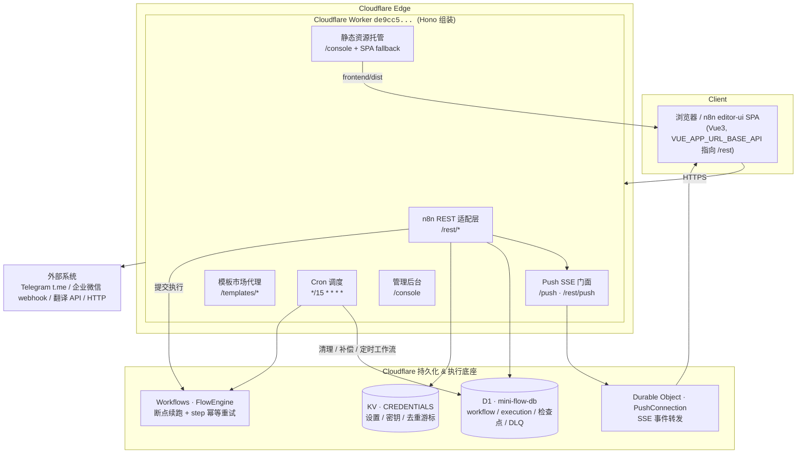
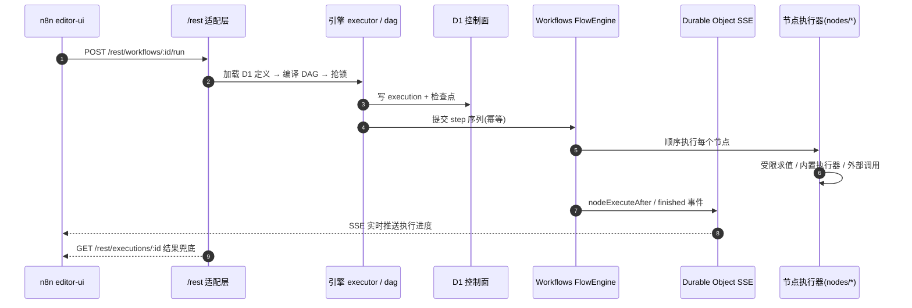
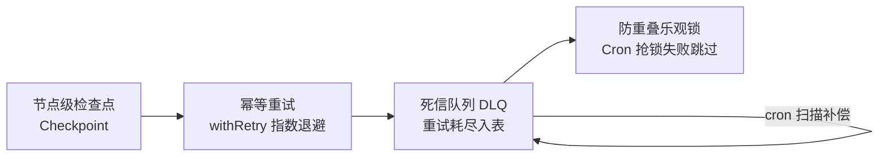
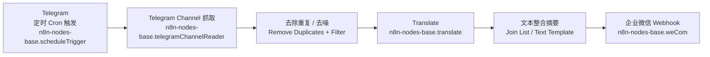

# mini-flow

把 n8n 的可视化工作流编排 + 节点执行能力，**原生化搬迁到 Cloudflare Workers** 的轻量引擎，并内置"防丢失与中断恢复"（检查点、幂等重试、死信队列、防重叠锁）。

前端 **100% 复用 n8n editor-ui**（不改源码），后端在 Workers 上复刻 n8n REST 契约 + Push(SSE) 协议，形成完整可用的可视化工作流平台。

> 权威决策见 [`DECISIONS.md`](./DECISIONS.md)。

---

## 架构总览

### 1. 系统部署架构（Cloudflare）



### 2. 一次工作流执行的内部分层



### 3. 韧性四机制



---

## 目录结构

```
mini-flow/
├── wrangler.jsonc            # Worker + D1 + KV + Workflows + Durable Object + assets + cron
├── package.json / tsconfig.json
├── schema.sql                # D1 Schema（含恢复扩展表 + DLQ + 索引）
├── DECISIONS.md              # 已确认决策记录
├── scripts/gen-nodes-json.ts # 生成 nodes.json / node-versions.json（节点元数据前端同步）
├── frontend/dist/            # n8n editor-ui 构建产物（复用，接入说明见 frontend/README.md）
└── src/
    ├── index.ts              # Hono 装配 + Push 挂载 + SPA fallback + cron 入口
    ├── types.ts              # 核心类型 + Env 绑定(DB/CREDENTIALS/PUSH/FLOW_ENGINE/ASSETS)
    ├── db/schema.ts          # 表结构定义（对应 schema.sql）
    ├── engine/               # 韧性核心
    │   ├── evaluator.ts      # 受限表达式求值器（替代 Code 节点的 new Function）
    │   ├── retry.ts          # withRetry 指数退避
    │   ├── checkpoint.ts     # 节点检查点读写与恢复
    │   ├── lock.ts           # 乐观锁 + 超时清理
    │   ├── dead-letter.ts    # DLQ 写入 / 扫描 / 重建
    │   ├── dag.ts            # n8n workflow JSON → 步骤序列（含条件分支）
    │   ├── scheduler.ts      # 已激活定时工作流调度
    │   └── executor.ts       # 业务调度入口：锁 → 检查点 → 提交 Workflows
    ├── runtime/
    │   ├── flow-engine.ts    # extends WorkflowEntrypoint：step 断点续跑
    │   └── push.ts           # Durable Object：SSE Push 门面
    ├── nodes/                # 节点执行实现（真实可执行）
    │   ├── index.ts          # 节点注册表
    │   ├── telegram.ts       # t.me 公开频道抓取（无需 token）
    │   ├── messaging.ts      # 企业微信 webhook + 翻译
    │   ├── http-request.ts / notify.ts / webhook.ts
    │   ├── if-condition.ts / logic.ts / transform.ts / text.ts / util.ts / extra.ts
    │   ├── ai.ts / db.ts / code-node.ts
    │   └── triggers.ts / common.ts
    ├── plugins/              # 插件化节点注册
    │   ├── builtin.ts        # n8n-nodes-base 全量节点定义（含执行器）
    │   ├── registry.ts       # 插件注册中心
    │   └── types.ts / index.ts
    └── n8n/                  # n8n REST 契约适配层
        ├── router.ts         # /rest/* 路由聚合
        ├── auth.ts / settings.ts / aux.ts / projects.ts
        ├── node-types.ts     # nodeTypes 元数据（由 plugins 注册表输出）
        ├── workflows.ts      # workflows CRUD + run
        ├── executions.ts     # executions 列表 / 详情 / 重试
        ├── templates.ts / templates-presets.ts  # 模板市场代理 + 预设
        ├── dead-letter.ts    # DLQ 管理端点
        ├── console.ts        # 管理后台页
        └── push.ts           # 与 runtime/push 对接，订阅执行事件
```

---

## 运行时绑定

| 绑定 | 类型 | 用途 |
| --- | --- | --- |
| `DB` | D1 | workflow 定义、execution、检查点、锁、DLQ（`mini-flow-db`） |
| `CREDENTIALS` | KV | 用户设置、密钥、翻译/消息去重游标 |
| `PUSH` | Durable Object | SSE 门面，把执行进度转发给前端 |
| `FLOW_ENGINE` | Workflows | 断点续跑 + step 幂等重试（`FlowEngine`） |
| `ASSETS` | Static Assets | 托管 `frontend/dist`（n8n editor-ui） |
| cron | `*/15 * * * *` | 锁清理 + DLQ 补偿 + 定时工作流 |

---

## 快速开始

```bash
npm install
# 1) 建 D1
npx wrangler d1 create mini-flow-db            # 把 database_id 填进 wrangler.jsonc
npx wrangler d1 execute mini-flow-db --file=schema.sql
# 2) 本地
npm run dev
# 3) 类型检查
npm run type-check
# 4) 同步节点元数据到前端（已在 predeploy 自动执行）
npm run gen:nodes
# 5) 部署
npm run deploy
```

---

## 内置节点

共 **约 68 个节点**，通过插件注册中心统一管理元数据与执行器，保证"编辑器面板"与"运行时执行"同源（图标、参数、行为一致）。

核心分类：

- **触发器**：Manual Trigger / Webhook / 定时 Cron / Form Trigger / Interval Trigger / Error Trigger
- **Telegram 抓取**：`Telegram Channel`（抓取 t.me 公开频道最近消息，无需 token）
- **数据处理**：IF / Switch / Set / Merge / Filter / Sort / Aggregate / Math / Date & Time / Limit / Rename Keys / Zip / Item Lists / Flatten / Split To Items / Pick & Remove Fields / Assign / Convert To JSON / Join List
- **文本处理**：Text Replace / Regex Extract / Text Case / Text Split / Text Template / Text Truncate / Text Count / Text Trim / Text Slice
- **通信 / 通知**：企业微信 `weCom`（群机器人 webhook）、HTTP Send / Webhook Send、Telegram / Slack / Discord / Email / SendGrid（占位，需凭据）
- **翻译**：`Translate`（Google 免费 / MyMemory / OpenAI 兼容引擎可配，未配回退原文）
- **存储**：D1 Query / SQLite / KV `Store`
- **AI**：OpenAI Chat（OpenAI 兼容，如 Workers AI）/ Embeddings / Hugging Face（后两者占位）
- **辅助**：Sticky Note / NoOp / Output / Delay / Split In Batches / Remove Duplicates / Add Metadata

---

## 典型业务场景

最简 `Telegram → 翻译 → 企业微信` 工作流：



节点执行细节（见 `src/nodes/telegram.ts`、`src/nodes/messaging.ts`）：

- **抓取**：解析 t.me/s/ 公开页 HTML，提取时间、作者、文本，做数字实体解码与噪音过滤。
- **翻译**：`translateNode` 按引擎配置调用 Google / MyMemory / OpenAI 兼容接口；目标简体中文且原文已是中文时直通，翻译失败回退原文，保证下游非空。密钥可从节点参数或 KV `openai_api_key` 读取。
- **整合推送**：`weComSendNode` 把多条输入整合成按频道分组的 markdown 摘要（每频道限条、总条数上限、超长截断、微信 4096 字节护栏），POST 到企业微信群机器人 webhook（`key=` 校验）。

---

## 状态

- [x] 前端复用 n8n editor-ui（图标 / 参数面板 NDV / 节点面板 / 控制面板均已接通）
- [x] 节点注册中心 + 68 个内置节点（同源元数据与执行器）
- [x] n8n REST 契约适配（settings/auth/workflows/executions/node-types/projects/templates…）
- [x] 韧性四机制（检查点 / 幂等重试 / DLQ / 防重叠锁） + Workflows 断点续跑
- [x] Push SSE 门面（Durable Object）
- [x] Telegram 抓取 → 翻译 → 企业微信推送闭环